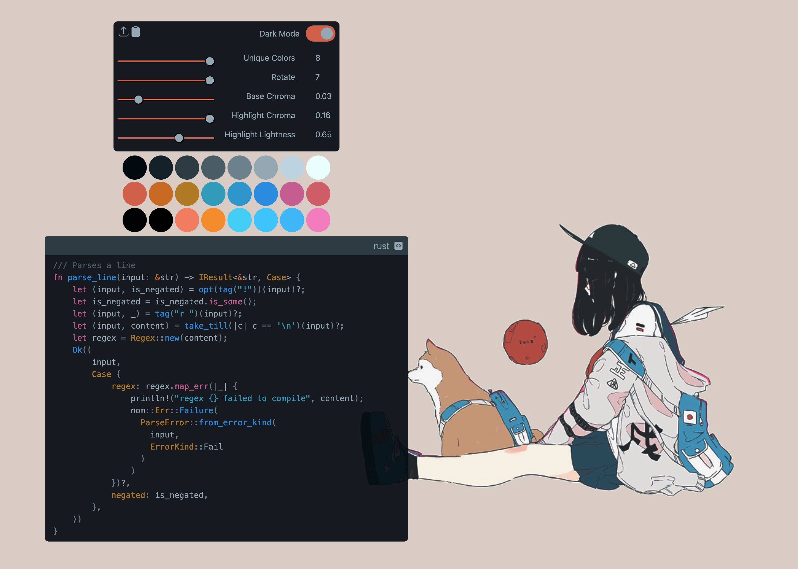

# Iro

Iro generates [Base24](https://github.com/tinted-theming/base24) color schemes from images using the [OKLAB](https://bottosson.github.io/posts/oklab/) perceptually-uniform color space.

You can use Iro as a [web application](https://loganwalls.github.io/iro/):


or as a CLI tool:
```
Usage: iro-cli [OPTIONS] <PATH>

Arguments:
  <PATH>  Path to the image

Options:
  -l, --light                        Generates light color schemes when true
  -k, --keep <KEEP>                  The number of colors to keep from the image [default: 8]
  -r, --rotation <ROTATION>          How many positions to rotate the highlight colors [default: 0]
  -s, --segment-size <SEGMENT_SIZE>  The size (in degrees) of a color wheel segment that should be treated as a single hue [default: 15]
  -b, --base-chroma <BASE_CHROMA>    The chroma to use for base colors
  -h, --hl-lightness <HL_LIGHTNESS>  The lightness to use for highlight colors
  -h, --hl-chroma <HL_CHROMA>        The chroma to use for highlight colors
  -h, --help                         Print help
  -V, --version                      Print version
```

# Install
## Nix
To try out Iro temporarily:
```sh
nix shell 'github:LoganWalls/iro'
```

To use Iro in a flake:
```nix
{
  inputs = {
    nixpkgs.url = "github:NixOS/nixpkgs/nixos-unstable";
    iro = {
        url = "github:LoganWalls/iro";
        inputs.nixpkgs.follows = "nixpkgs";
    };
  };
  outputs = {nixpkgs, ...}@inputs: let
    inherit (nixpkgs) lib;
    withSystem = f:
      lib.fold lib.recursiveUpdate {}
      (map f ["x86_64-linux" "x86_64-darwin" "aarch64-linux" "aarch64-darwin"]);
  in
    withSystem (
      system: let
        pkgs = nixpkgs.legacyPackages.${system};
        iro = inputs.iro.packages.${system}.default;
      in
        with pkgs; {
          devShells.${system}.default = mkShell {packages = [ iro ];};
        }
    );
};
```

## From source
1. Install the [rust toolchain](https://rustup.rs/)
2. Clone this repository
3. Enter the cloned repository
4. Run `cargo build --release`
5. Add the binary at `./target/release/iro` to your `$PATH`

# Usage
1. Choose an image that you want to use as the basis for your color scheme
2. Run Iro from the CLI or [Web App](https://loganwalls.github.io/iro/) using that image
3. *(Optional)* Customize your theme using Iro's options (exposed as sliders in the Web App or options in the CLI)

The steps above will produce a color scheme in YAML format that complies with
the Base24 spec (if using the Web App you can copy the YAML to your clipboard
using the icon at the top left of the interface). To use the color scheme in
your programs, run it through a Base24 builder such as
[Flavours](https://github.com/Misterio77/flavours) or
[base-24-builder-python](https://github.com/tinted-theming/tinted-builder-python)
to generate Base16/24 color schemes for any [supported program](https://github.com/tinted-theming/base24?tab=readme-ov-file#supported-applications-base24).


# Acknowledgements
A huge thank you to everyone who answered my questions and helped me learn
along the way while working on this project!

An extra special thank you to the following people:
- [Stefan Todorov](https://github.com/coravacav)
- [AlphaKeks](https://git.sr.ht/~alphakeks)
- [Greg Johnston](https://github.com/gbj)

The image used in the screenshot above was  created by [daisukerichard](https://daisukerichard444.wixsite.com/daisukerichard/blank).
